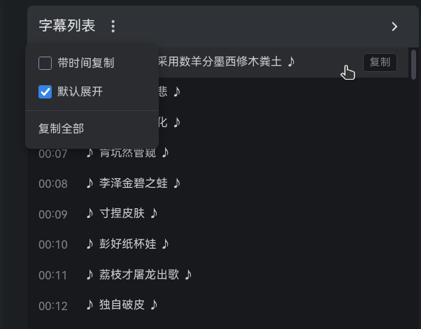

# Bilibili 字幕列表

在 Bilibili 视频页面显示字幕列表，支持点击跳转、当前行高亮、单行/全部复制（可选择是否附带时间）、多语言切换（如果字幕有多语言）。

## 功能特性

- **字幕列表**：自动获取视频字幕，在弹幕框上方显示可折叠面板
- **点击跳转**：点击任意字幕行，视频跳转到对应时间点
- **当前行高亮**：正在播放的字幕高亮显示，并随播放进度在面板内自动滚动
- **单条复制**：每条字幕旁有复制按钮，可切换是否携带时间戳（`00:05 - 字幕内容`）
- **复制全部**：一键复制整个字幕列表，可切换是否携带时间戳
- **多语言切换**：视频有多种语言字幕时，工具栏下拉切换
- **折叠/展开**：面板可折叠，默认展开状态可记忆（持久化在本地）
- **暗色模式**：自动适配页面明暗主题
- **SPA 适配**：Bilibili 页面切换无需刷新，自动重建面板

## 安装

> 这是未签名的本地开发版，通过 Firefox 临时加载安装。要永久安装并自动更新，请上 [Firefox Add-ons](https://addons.mozilla.org/) 商店下载Bilibili 字幕列表。

1. 打开 Firefox，地址栏输入 `about:debugging#/runtime/this-firefox`
2. 点击「临时载入附加组件」
3. 选择本项目的 `manifest.json`（或打包好的 zip 文件）
4. 打开任意 Bilibili 视频页即可看到字幕面板

> 注意：临时加载的扩展在 Firefox 重启后失效，需重新载入。

## 使用说明

- **跳转**：点击字幕行的文本区域
- **复制单条**：鼠标悬停在字幕行，点击右侧「复制」按钮
- **更多选项**：点击面板左上角的 `⋮` 菜单：
  - `带时间复制`：勾选后复制内容携带时间戳
  - `默认展开`：勾选后每次打开默认展开面板
  - `复制全部`：复制整个字幕列表

## 权限说明

- **`*.bilibili.com`**：从 Bilibili 接口获取视频信息与字幕数据
- **`*.hdslb.com`**：加载字幕资源文件

扩展向 Bilibili 接口请求时会携带你的 Bilibili 登录 Cookie（`credentials: include`），用于获取登录用户的字幕权限。这些 Cookie 仅发送给 Bilibili 官方域名，不传输到任何第三方。

**本扩展不采集、不存储、不上传任何用户数据**（`data_collection_permissions: none`）。本地仅持久化两个界面偏好：`带时间复制` 和 `默认展开` 开关。

## 常见问题

**是否使用 AI？**
code 和调试几乎全程依赖 AI 实现。

**视频没有字幕？**
并非所有视频都有字幕。只有 UP 主上传了字幕（或 AI 字幕）的视频才会显示字幕面板。

**为什么有两个域名权限？**
Bilibili 的视频信息与字幕列表来自 `*.bilibili.com`，字幕实际内容往往存放在 `*.hdslb.com`（Bilibili 的 CDN 域名）上，两个都要访问才能完整显示。

**能在 Chrome 用吗？**
代码本身不依赖 Firefox 专属 API，理论上 Chrome/Edge 也能用。当前 Manifest 按 Firefox 的 Manifest V2 编写（`browser_action`、`browser_specific_settings`），在 Chrome 使用需将 manifest 转为 V3 并改用 `action`。

## 许可证

[MIT](LICENSE)

本项目灵感与数据均来自 Bilibili 公开接口，与 Bilibili 官方无关。代码为独立实现。
